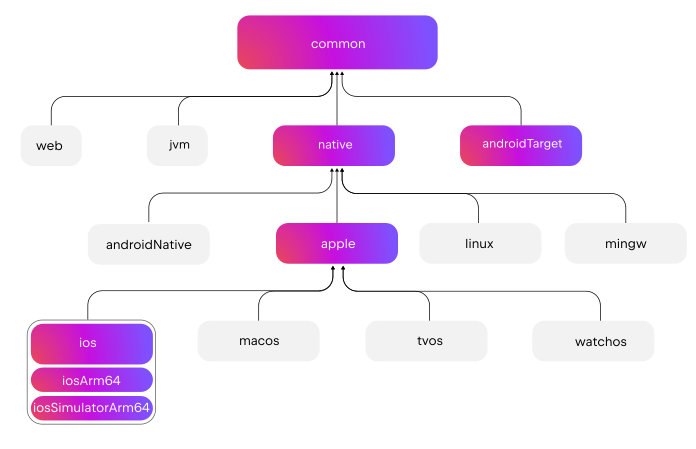
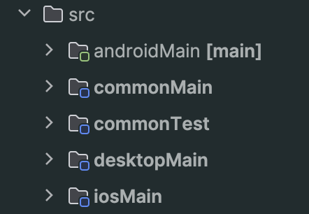

+++
title = "KMP: Roll your own mobileMain"
cardimage = 'mobilemain.png'
date = 2025-12-23T00:55:54+03:00
draft = false
+++


The increasing expansion of the Kotlin Multiplatform (KMP) and Compose Multiplatform (CMP) support for Android Studio has made the development a breeze.

In some rare cases our trusty tools are not there yet. 

For instance [ until last year the inability to preview Composables in commonMain](https://youtrack.jetbrains.com/issue/CMP-2045/Preview-annotation-in-commonMain-sourceSet), or the lack of a new project template (also not the case anymore).

Recently, I hit one such wall and at the same time discovered there's a new experimental tool to solve it! Let's see it.

## The default KMP Hierarchy template. 
Every new KMP project has the following barebones hierarchy template: 




Lets say we want to have some common code only for the mobile platforms (iOS and Android).

The documented way to do that is the following:

```kotlin {style=gruvbox}
// build.gradle.kts (:composeApp)

plugins {
    alias(libs.plugins.kotlinMultiplatform)
}

kotlin {
    // ... define the targets 

    sourceSets {
        commonMain {
            dependencies {
                // ...
            }
        }

        val mobileMain by creating
        mobileMain {
            dependsOn(commonMain.get())
            dependencies { implementation(libs.some.lib) }
        }

        iosMain {
            dependsOn(mobileMain.get())
        }

        androidMain {
            dependsOn(mobileMain.get())
        }
    }
}

```

Lets note here that we also need to create the directory `/myProject/composeApp/src/mobileMain/kotlin`.


This works just fine! The project builds, runs the common code in `mobileMain` and we're all happy. 

So .. what's the deal then. 

## The deal 

The IDE does not treat the `mobileMain` as a first-class source set like `commonMain`, `androidMain` etc.



We don't get the context menu to define an `actual` implementation for an `expect`.
And any other source set dependent IDE functionality.

## The seal 🦭 

Enter [`applyHierarchyTemplate()`](https://kotlinlang.org/api/kotlin-gradle-plugin/older/2.1.20/kotlin-gradle-plugin-api/org.jetbrains.kotlin.gradle.dsl/-kotlin-hierarchy-dsl/apply-hierarchy-template.html). 

The new experimental way to define source sets in a flexible and intuitive way, and significantly improves IDE awareness.

In our simple case above the equivalent is now: 

```kotlin {style=gruvbox}

kotlin {
     applyHierarchyTemplate(KotlinHierarchyTemplate.default) {
        common {
            group("mobile") {
                withAndroidTarget()
                group("ios") {
                    withIosArm64()
                    withIosX64()
                    withIosSimulatorArm64()
                }
            }
        }
    }

    // ...
}
```

Which now produces a more IDE friendly integration, with the expected module awareness
and its side effects. 


The extent to which we can configure the project is very flexible and built in a way 
that does not mess with the default hierarchy. 

For more: see the [documentation](https://kotlinlang.org/api/kotlin-gradle-plugin/older/2.1.20/kotlin-gradle-plugin-api/org.jetbrains.kotlin.gradle.dsl/-kotlin-hierarchy-dsl/apply-hierarchy-template.html) of the hierarchy builder. Also, good to have in mind the [complete default hierarchy template](https://kotlinlang.org/docs/multiplatform/multiplatform-hierarchy.html#see-the-full-hierarchy-template), with all the targets you can group together.

Happy KMPing!
